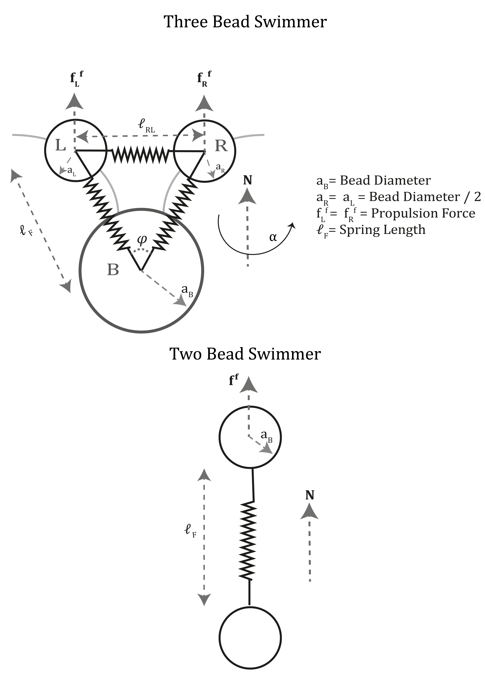

# Micro-Swimmer Simulation

This repository contains MATLAB scripts for simulating pair-wise interactions between micro-swimmers.
The simulation is based on spring-bead swimmer. For more details, see:

1. Lushi, Enkeleida, Vasily Kantsler, and Raymond E. Goldstein. "Scattering of biflagellate microswimmers from surfaces." Physical Review E 96.2 (2017): 023102.

## Files in this Repository

- `scripts/config.m`: Contains configurations and parameters for the simulation.
- `scripts/main.m`: The main script that uses the configurations from `config.m` and runs the simulation.

## How to Run

1. Clone this repository.
2. Open MATLAB.
3. Navigate to the `scripts` directory.
4. Run `main.m`.
5. Configuration of the simulation like position and orientation of the swimmers can be changed in config.m

## Results

The results include plots and optionally a video of the simulation.

## Nomenclature for config File
